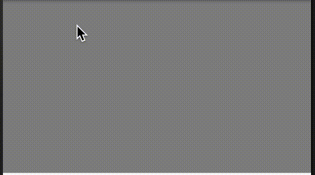

# GuaGuaCard

Android custom view

### 使用方法 ###

在gradle根目录仓库加上 

```groovy

maven { url 'https://dl.bintray.com/marsor707/maven' }

```

在module的gradle依赖加上 

```groovy

compile 'com.github.marsor707:guaguacard:1.0.0'

```

或者

```xml

<dependency>
  <groupId>com.github.marsor707</groupId>
  <artifactId>guaguacard</artifactId>
  <version>1.0.0</version>
  <type>pom</type>
</dependency>

```

在布局文件中使用

```xml
<!-- app:gg_per 表示大于这个百分比显示全部图片 默认40% -->
<!-- app:gg_src 表示刮掉后显示的图片 -->
<com.github.marsor707.guaguacard.GuaGuaCard
        android:id="@+id/guagua"
        android:layout_width="match_parent"
        android:layout_height="wrap_content"
        app:gg_per="30"
        app:gg_src="@drawable/xixi" />
```

在java中设置监听器

```java

GuaGuaCard guaGuaCard = findViewById(R.id.guagua);
guaGuaCard.setGuaGuaListener(new GuaGuaCard.GuaGuaListener() {
    @Override
    public void onComplete() {
        Log.d(TAG, "刮刮卡完成");
    }
 });
        
```

### 演示 ###
